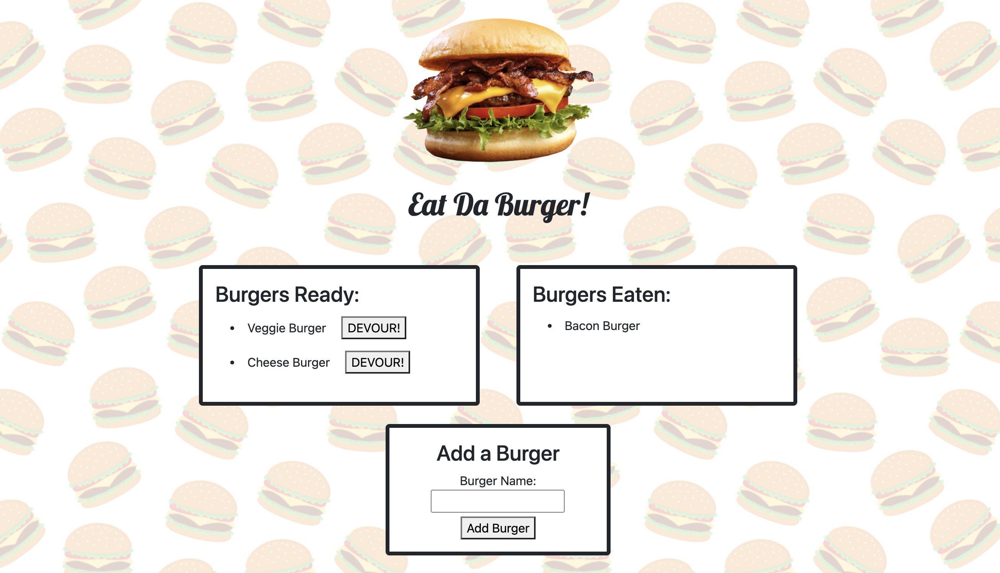

# eat-da-burger

## Description

This is my eleventh homework assignment for the University of Denver Web Development Boot Camp!  

For this project, I was to build a full-stack app that allows a user to enter and 'devour' hamburgers. The hamburgers entered by the user are stored in the back end database, and the front end is built using Handlebars to dynamically generate page content. 

## Deployment

The code (and associated assets) are hosted right here in this GitHub repository, and it's all live on the web thanks to Heroku. If you would like to check it out, you can view the site at the link below:

<a href="" target="_blank"><b>eat-da-burger Live App</b></a>
  

## Credits

This project was made using HTML, CSS, Javascript, Node.js, Express.js, MySQL, and Handlebars.
